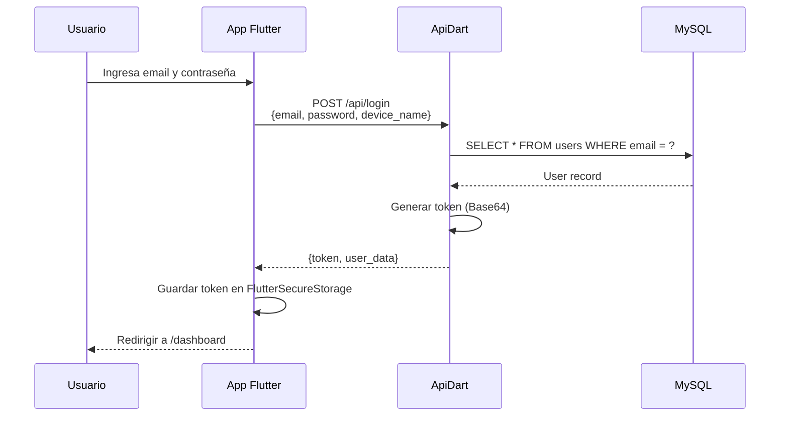
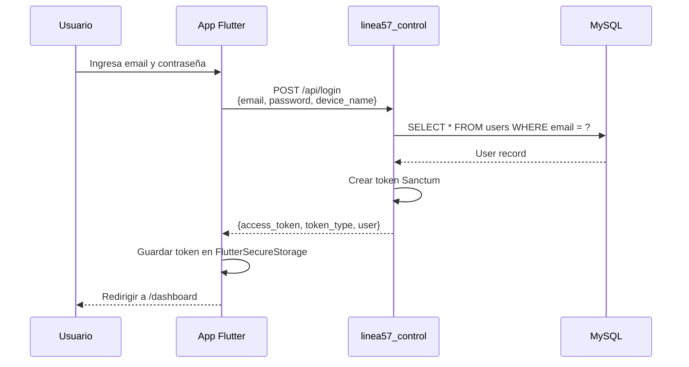
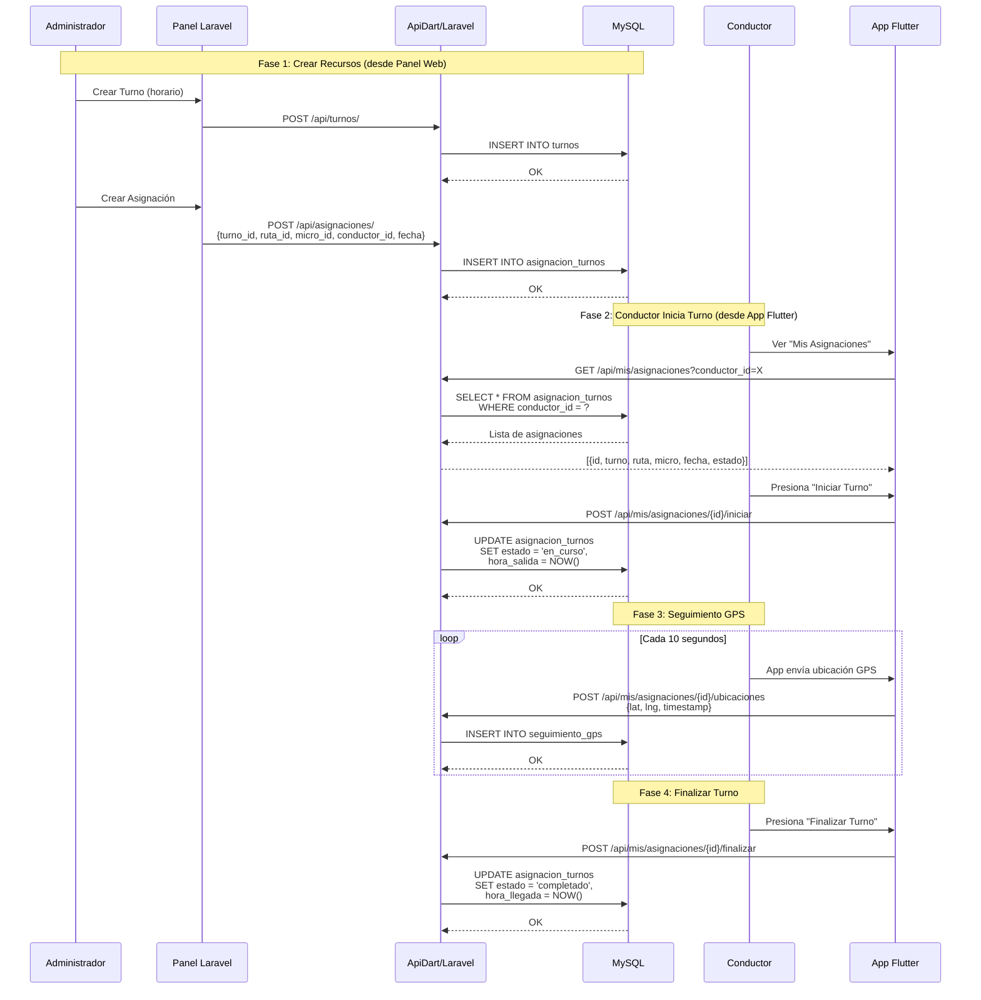
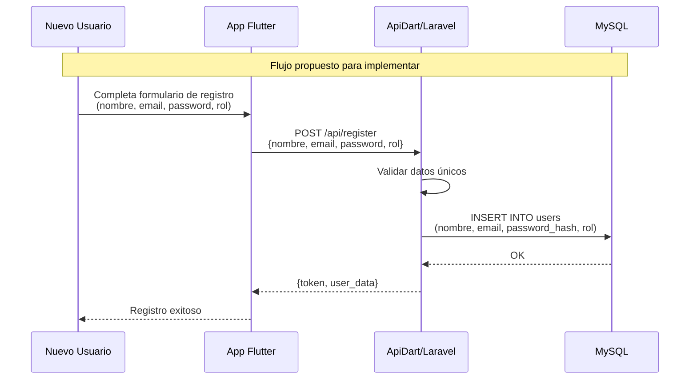
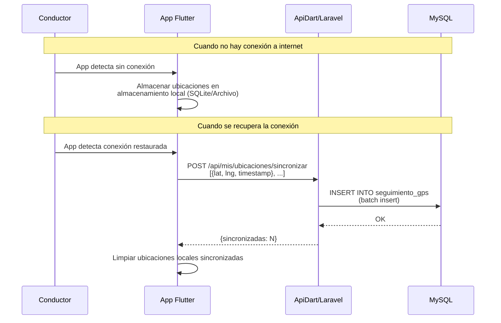
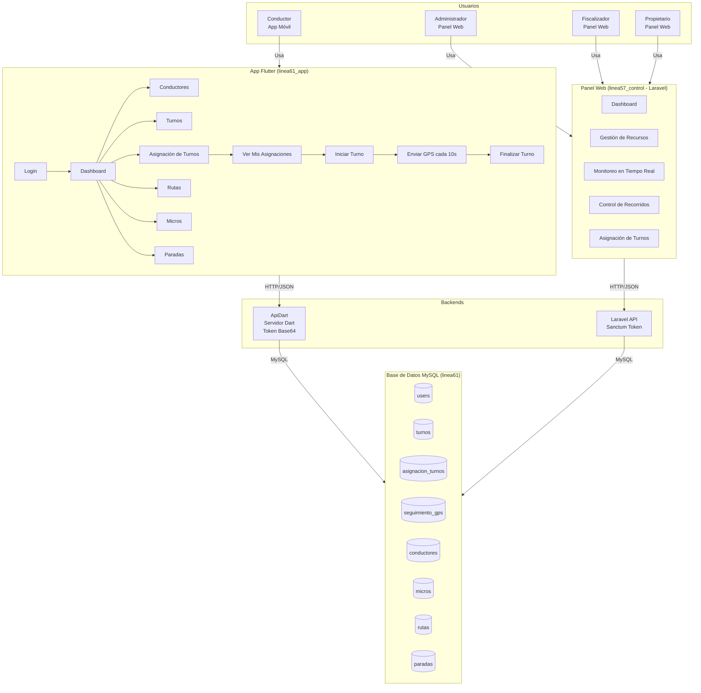

# Flujo del Sistema - Línea 61

## Arquitectura General

```
┌─────────────────────────────────────────────────────────────────────────────┐
│                              USUARIOS                                      │
│  ┌──────────────┐  ┌──────────────┐  ┌──────────────┐  ┌──────────────┐  │
│  │ Conductor    │  │ Administrador│  │Fiscalizador  │  │ Propietario  │  │
│  │ (App Móvil)  │  │ (Panel Web)  │  │ (Panel Web)  │  │ (Panel Web)  │  │
│  └──────┬───────┘  └──────┬───────┘  └──────┬───────┘  └──────┬───────┘  │
└─────────┼──────────────────┼──────────────────┼──────────────────┼─────────┘
          │                  │                  │                  │
          ▼                  ▼                  ▼                  ▼
┌─────────────────┐  ┌──────────────────────────────────────────────────────┐
│  linea61_app    │  │              linea57_control (Laravel)               │
│  (App Flutter)  │  │  ┌────────────────────────────────────────────────┐  │
│                 │  │  │  Panel Web (Blade + Tailwind)                  │  │
│  - Provider     │  │  │  - Dashboard                                  │  │
│  - MVVM         │  │  │  - Gestión de recursos                        │  │
│  - Token Bearer │  │  │  - Monitoreo en tiempo real                   │  │
│                 │  │  │  - Control de recorridos                      │  │
│                 │  │  └────────────────────────────────────────────────┘  │
│                 │  │  ┌────────────────────────────────────────────────┐  │
│                 │  │  │  API REST (Laravel Sanctum)                    │  │
│                 │  │  │  - /api/login                                 │  │
│                 │  │  │  - /api/conductores                           │  │
│                 │  │  │  - /api/mis/asignaciones                     │  │
│                 │  │  │  - /api/mis/asignaciones/{id}/ubicaciones    │  │
│                 │  │  └────────────────────────────────────────────────┘  │
└────────┬────────┘  └──────────────────────┬───────────────────────────────┘
         │                                  │
         │         ┌────────────────┐       │
         └────────▶│    ApiDart     │◀──────┘
                   │ (Servidor Dart)│
                   │  - Shelf       │
                   │  - Token Base64│
                   └───────┬────────┘
                           │
                           ▼
                   ┌───────────────┐
                   │     MySQL     │
                   │   linea61     │
                   │               │
                   │ - users       │
                   │ - conductores │
                   │ - turnos      │
                   │ - asignacion_ │
                   │   turnos      │
                   │ - seguimiento_│
                   │   gps         │
                   │ - rutas       │
                   │ - paradas     │
                   │ - micros      │
                   └───────────────┘
```

---

## 1. Flujo de Autenticación (Login)

### Opción A: vía ApiDart (Actual)



### Opción B: vía Laravel (linea57_control)



---

## 2. Flujo de Asignación de Turnos



---

## 3. Flujo de Registro de Usuarios (FALTA IMPLEMENTAR)

> **ESTADO:** No existe ni en la app Flutter ni en el backend ApiDart.
> Los usuarios se crean directamente en la base de datos.



---

## 4. Flujo de Sincronización Offline (GPS)



---

## 5. Flujo Completo del Sistema (Vista General)



---

## 6. Comparación de Backends

| Característica | ApiDart (Dart/Shelf) | linea57_control (Laravel) |
|----------------|----------------------|---------------------------|
| **Lenguaje** | Dart | PHP 8.3+ |
| **Framework** | Shelf | Laravel 13 |
| **Token** | Base64 simple | Sanctum (Bearer) |
| **Base de datos** | MySQL `linea61` | MySQL `linea61` |
| **Panel Web** | ❌ No tiene | ✅ Blade + Tailwind |
| **API REST** | ✅ Básica | ✅ Completa |
| **Roles/Permisos** | ⚠️ Básico | ✅ Spatie Permission |
| **Documentación API** | ❌ No tiene | ✅ Swagger/OpenAPI |
| **Tests** | ⚠️ Básicos | ✅ PHPUnit + Feature |
| **Migraciones** | ✅ SQL files | ✅ Laravel Migrations |
| **Validación** | ⚠️ Manual | ✅ Form Requests |

---

## 7. Estado Actual vs. Funcionalidades Faltantes

| Funcionalidad | App Flutter | ApiDart | Laravel | Estado |
|---------------|-------------|---------|---------|--------|
| Login | ✅ | ✅ | ✅ | Completo |
| Logout | ✅ | ✅ | ✅ | Completo |
| Registro de usuarios | ❌ | ❌ | ❌ | **FALTA** |
| Listar conductores | ✅ | ✅ | ✅ | Completo |
| Crear conductores | ✅ | ✅ | ✅ | Completo |
| Listar turnos | ✅ | ✅ | ✅ | Completo |
| Crear turnos | ✅ | ✅ | ✅ | Completo |
| Asignación de turnos | ✅ | ✅ | ✅ | Completo |
| Iniciar turno | ✅ | ✅ | ✅ | Completo |
| Finalizar turno | ✅ | ✅ | ✅ | Completo |
| Seguimiento GPS | ✅ | ✅ | ✅ | Completo |
| Sincronización offline | ✅ | ✅ | ✅ | Completo |
| Monitoreo en tiempo real | ❌ | ❌ | ✅ | Solo Laravel |
| Control de paradas | ❌ | ❌ | ✅ | Solo Laravel |
| Recuperar contraseña | ❌ | ❌ | ❌ | **FALTA** |
| Roles y permisos | ⚠️ | ⚠️ | ✅ | Parcial |
| Documentación API | ❌ | ❌ | ✅ | Solo Laravel |

---

## 8. Recomendaciones

### Prioridad Alta
1. **Unificar backends** - Decidir si se usa ApiDart o Laravel como backend principal
2. **Implementar registro de usuarios** - Tanto en la app como en el backend
3. **Mejorar seguridad del token** - Actualizar de Base64 a JWT/Sanctum
4. **Hash de contraseñas** - Implementar bcrypt en el backend

### Prioridad Media
5. **Recuperación de contraseña** - Flujo de reset por email
6. **Roles y permisos** - Sistema más robusto de autorización
7. **Validación de datos** - Tanto en frontend como backend
8. **Migrar app Flutter a Laravel** - Si se decide usar Laravel como backend único

### Prioridad Baja
9. **Notificaciones push** - Alertas de asignaciones nuevas
10. **Reportes y estadísticas** - Dashboard administrativo
11. **API unificada** - Documentación Swagger completa

---

## 9. Decisión de Arquitectura

### Opción A: Mantener ambos backends
- **ApiDart** para la app Flutter (ligero, rápido)
- **Laravel** para el panel web y administración
- **Ventaja:** No hay que migrar código existente
- **Desventaja:** Dos backends que mantener

### Opción B: Migrar todo a Laravel (Recomendado)
- **Laravel** como único backend
- **ApiDart** se descontinua o usa solo para pruebas
- **Ventaja:** Un solo backend, más robusto, con documentación
- **Desventaja:** Hay que actualizar la app Flutter para usar los endpoints de Laravel

### Opción C: Migrar todo a ApiDart
- **ApiDart** como único backend
- **Laravel** se descontinua
- **Ventaja:** Un solo backend, más ligero
- **Desventaja:** Perder todas las funcionalidades de Laravel (panel web, roles, etc.)
